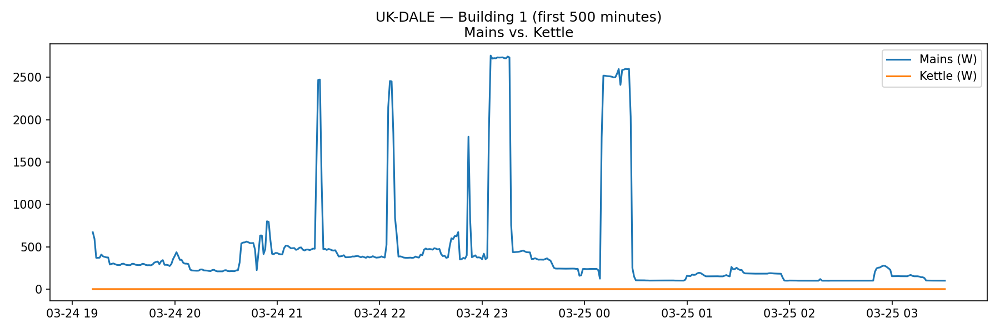
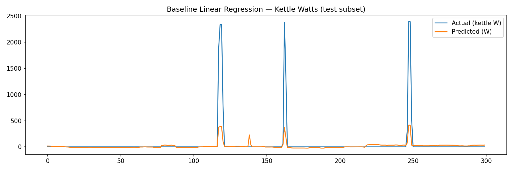
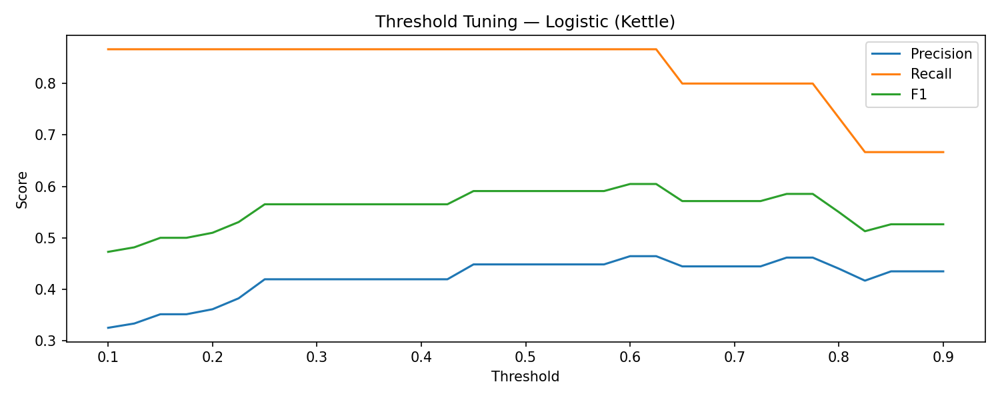
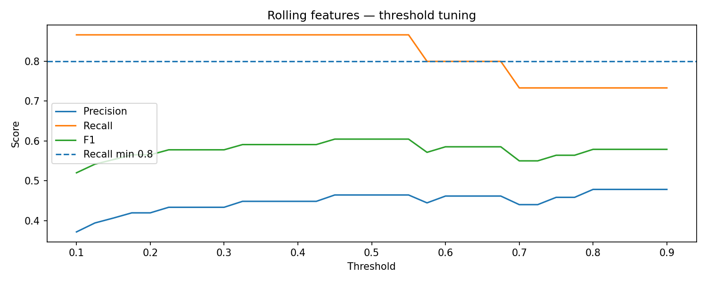
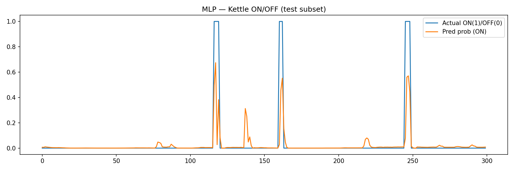
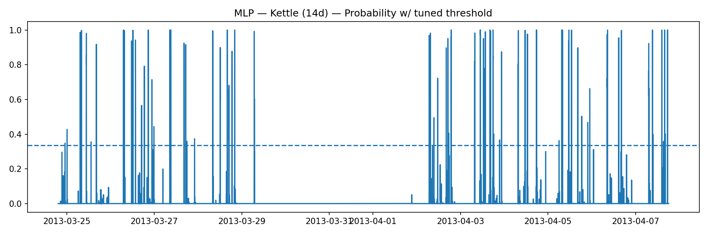
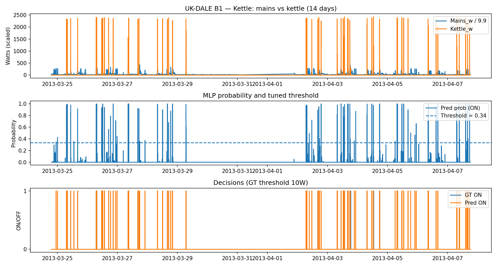
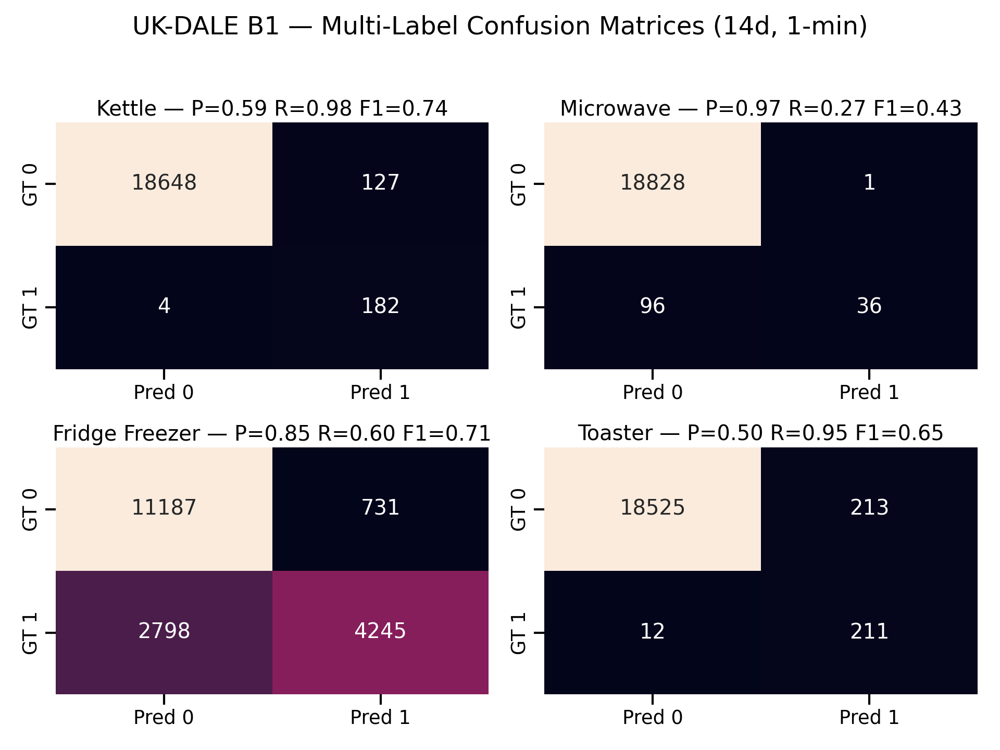

# 🇬🇧 UK-DALE NILM — Linear / Logistic / MLP Baselines  
**Building 1 · 1-minute aggregation · 14-day context windows**  
**Models:** Linear Regression · Logistic Regression · MLP · Multi-Label Joint Learning  

---

## 📌 Overview

This repository develops **interpretable Non-Intrusive Load Monitoring (NILM)** baselines using the **UK-DALE** dataset.  
The goal is to disaggregate mains electricity signals into individual appliance usage patterns — comparing **classical regression models** and **deep neural networks** under controlled, reproducible setups.

### Dataset & Scope
- **Dataset:** UK-DALE (Building 1, March–April 2013)
- **Resolution:** 1-minute aggregated mains + sub-metered appliance data  
- **Appliances modeled:** Kettle, Microwave, Fridge-Freezer, Toaster  
- **Windowing:** 14-day temporal context for sequence-based models  
- **Task:** Predict ON/OFF appliance states or continuous wattage from mains readings  
- **Goal:** Benchmark interpretability, precision–recall trade-offs, and temporal context effects

---

## ⚙️ Methodology

| Model | Type | Key Features | Target |
|-------|------|---------------|---------|
| **Linear Regression** | Baseline regression | Learns direct watt-level relationships between mains and appliance | Predicts continuous watts |
| **Logistic Regression** | Binary classifier | Predicts ON/OFF states, threshold tuned for ≥0.85 recall | Binary state |
| **Rolling Logistic Regression** | Temporal smoothing | Applies rolling window over logits to reduce false transitions | Stable ON/OFF states |
| **MLP (Multi-Layer Perceptron)** | Deep neural model | Nonlinear representation with 7–14 day temporal context | Probability of ON |
| **Multi-Label Learning** | Joint training | Predicts multiple appliance states jointly | Kettle + Microwave + Fridge-Freezer + Toaster |

### Experimental Setup
- Implemented in **Python (PyTorch / scikit-learn / pandas / matplotlib / seaborn)**  
- Normalized inputs, Z-score scaling  
- Loss functions:  
  - MSE for regression  
  - Binary cross-entropy for classification  
- Metrics: Precision (P), Recall (R), and F1-score  
- Train/validation/test split: contiguous chronological segments within Building 1  

---

## 📊 Model Performance Summary

| Appliance | Precision (P) | Recall (R) | F1 Score |
|------------|---------------|------------|-----------|
| **Kettle** | 0.59 | 0.98 | 0.74 |
| **Microwave** | 0.97 | 0.27 | 0.43 |
| **Fridge-Freezer** | 0.85 | 0.60 | 0.71 |
| **Toaster** | 0.50 | 0.95 | 0.65 |

### Interpretation
- **Kettle:** High recall shows the MLP captures sharp, brief activations effectively.  
- **Microwave:** Excellent precision but low recall — short, infrequent bursts are easily missed.  
- **Fridge-Freezer:** Balanced performance due to regular periodic compressor cycles.  
- **Toaster:** High recall but moderate precision, indicating transient overlaps with other loads.

---

## 📈 Visual Gallery

### 🔹 Alignment (Ground Truth vs Mains)
Shows the correlation between aggregated mains consumption and individual appliance loads.



---

### 🔹 Regression & Logistic Models
<table>
<tr>
<td align="center">
  
  <br/><sub><b>Linear Regression:</b> Baseline watt-level reconstruction.</sub>
</td>
<td align="center">
  
  <br/><sub><b>Threshold Tuning:</b> Precision–recall trade-off optimization.</sub>
</td>
<td align="center">
  
  <br/><sub><b>Rolling Logistic:</b> Smoothed temporal predictions reduce flicker.</sub>
</td>
</tr>
</table>

---

### 🔹 Neural Networks (MLP)
<table>
<tr>
<td align="center">
  
  <br/><sub><b>7–14 Day Context:</b> MLP learns smooth temporal activations.</sub>
</td>
<td align="center">
  
  <br/><sub><b>14-Day Context:</b> Boosts recall and temporal stability.</sub>
</td>
<td align="center">
  
  <br/><sub><b>Decision Overlay:</b> Thresholded ON/OFF predictions.</sub>
</td>
</tr>
</table>

---

### 🔹 Multi-Label Overview
<p align="center">
  
  <br/><sub>Aggregated confusion across Kettle, Microwave, Fridge-Freezer, and Toaster (14d, 1-min).</sub>
</p>

---

## 🧠 Key Insights

1. **Temporal Context Improves Recall (14d > 7d):**  
   Broader context allows the MLP to capture recurring patterns and rare usage events.
2. **Threshold Tuning (≥ 0.85 Recall):**  
   Balances false positives/negatives, emphasizing reliable event detection.
3. **Nonlinear Transformations (MLP):**  
   Capture subtle temporal features missed by linear models, especially for fridge and toaster.
4. **Multi-Label Joint Setup:**  
   Enhances shared learning across correlated appliance signals — improving robustness on rare activations.
5. **Rolling Logistic Regression:**  
   Adds interpretability and temporal consistency, mitigating noisy per-minute fluctuations.

---

## 🔍 How Each Graph Contributes

| Graph | Purpose | Interpretation |
|--------|----------|----------------|
| **Ground Truth vs Mains** | Visualizes how aggregate power correlates with appliance-level consumption. | Demonstrates the basis of disaggregation learning. |
| **Linear Regression Overlay** | Shows baseline model performance. | Captures coarse watt-level patterns, misses fine spikes. |
| **Threshold Tuning Curves** | Compares precision/recall across decision boundaries. | Highlights trade-offs and optimal recall-based threshold. |
| **Rolling Logistic Plot** | Applies temporal smoothing. | Reduces false positives for transient loads. |
| **MLP Probability Plot** | Shows per-minute probability predictions. | Demonstrates smoother and more robust signal. |
| **MLP Decision Overlay** | Thresholded ON/OFF predictions. | Visual validation of event alignment accuracy. |
| **Multi-Label Confusion Matrix** | Aggregated confusion for all appliances. | Shows per-class precision and recall performance. |

---

## 🚀 Next Steps

- 🧩 Address class imbalance using **weighted BCE** or **SMOTE**.  
- 🧮 Integrate **Bayesian optimization** for hyperparameter tuning.  
- ⚙️ Extend to **sequence models (LSTM / Transformer)** for temporal reasoning.  
- 🏠 Evaluate **cross-building transfer** (B1 → B2–B5).  
- 🧭 Develop a **Streamlit dashboard** for interactive NILM comparisons.  
- 📦 Expand to **unsupervised embeddings** and anomaly detection.

---

## 🧩 Environment & Reproducibility

**Environment:**  
- Python 3.11 (Conda)  
- Packages: `pandas`, `numpy`, `torch`, `sklearn`, `matplotlib`, `seaborn`  

**Reproduce results:**
```bash
conda create -n ukdale311 python=3.11
conda activate ukdale311
pip install -r requirements.txt
python build_multi_appliance_csv.py
python evaluate_multilabel_predictions.py
python plot_multilabel_confusion.py

@misc{dahiya2025_ukdale_nilm_baselines,
  author = {Tejas Dahiya},
  title  = {UK-DALE NILM Baselines: Linear, Logistic, and MLP Models for Energy Disaggregation},
  year   = {2025},
  note   = {Building 1, 1-min aggregation, 14-day context}
}

